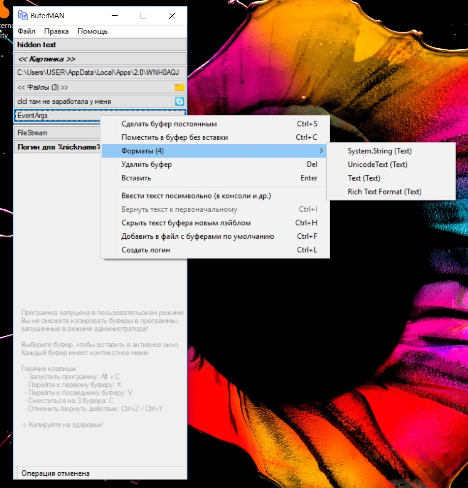

# BuferMAN
> Every man has the right to manage and control his clipboard buffers - magicmanam

## Description
This tool helps you with managing Windows clipboard buffers: text, files, images. It makes your work more effective, fun and proud. Russian and English languages are supported

## Installation
You can download BuferMAN program [here](https://github.com/magicmanam/buferman/releases/download/v1.2.1/BuferMAN-Setup-1.2.1.msi).

## Usage
**BuferMAN** helps you in copypasting of text, images and files data. It allows you to save your clipboard bufers and many hours of your time. Every bufer has a context menu with many useful features. At application start **BuferMAN** is initialized with lines from 'bufers.txt' file located at the root of the application. There you can store the most popular text bufers.

**!!! For correct usage with programs launched in administrative mode, BuferMAN should be started in admin mode as well.**

### Hot keys
Alt+C  - make BuferMAN visible

TAB    - tabify between bufers

Home   - go to the first bufer (or just key: X)

End    - go to the latest bufer (or just key: V)

C      - tabify 3 times

Ctrl+H - hide bufer with some alias

Space  - the same as Enter key - paste selected bufer into an active window

Ctrl+Z - undo previous operation

Ctrl+Y - redo previous operation

...

### Terms
*Bufer* - wrapper over Windows clipboard item.

*Credentials bufer* - a bufer which minimize your interaction with login forms. Initial bufer's value is used as username, password you can set using *Ctrl + L (Login)* hot key. After that just place a cursor at username field in login form, activate a program using *Alt + C* hot key and select credentials bufer. The program will type your username, press TAB, type a password and Enter key while you just enjoy you life. **Warning:** Passwords are stored in-memory as-is and w/o encryption, so please do not use this feature for real credentials.

### Comparing with other clipboard viewers
Comparison table of BuferMAN with similar tools (Ditto, Windows 10, ...) you can find [here](https://docs.google.com/spreadsheets/d/1XWATNmQqHqbnp1LXQSSaXm69ETPeDE0AL_RdLjBqzbA/edit?usp=sharing).

## License
GNU General Public License v3.0

## Thanks
I want to say thanks to the author of the icon I use in BuferMAN:
https://www.iconsdb.com/royal-blue-icons/copy-icon.html 
